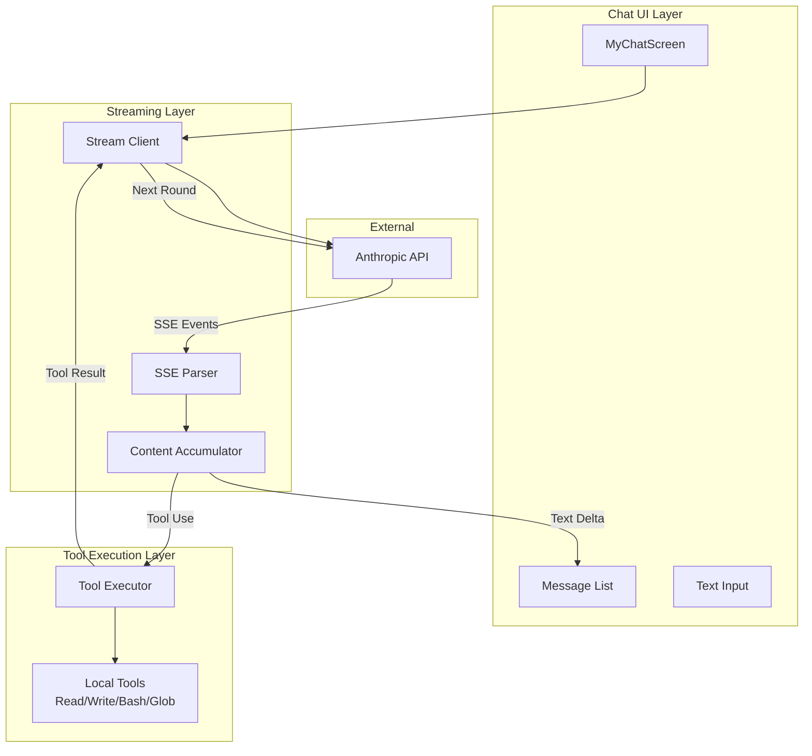

# Design Document: Streaming Chat Refactor

## Overview

本设计文档描述了将 MyChatScreen.tsx 从非流式（stream:false）改造为流式（stream:true）的技术方案。核心目标是实现文本与 tool_call 的即时处理和展示，提升用户体验。

改造将复用现有的 `parseAnthropicSSE.ts` 并进行扩展，保持与 Kode-cli 类似的 SSE 处理逻辑。

## Architecture



## Components and Interfaces

### 1. StreamClient

负责管理流式请求的生命周期和对话循环。

```typescript
interface StreamClientConfig {
  apiKey: string
  baseURL: string
  model: string
  timeoutMs: number  // default: 600000 (10 minutes)
}

interface StreamCallbacks {
  onTextDelta: (text: string) => void
  onToolStart: (toolName: string, toolId: string) => void
  onToolEnd: (toolId: string, result: string) => void
  onError: (error: Error) => void
  onComplete: () => void
}

class StreamClient {
  constructor(config: StreamClientConfig)
  
  async streamChat(
    messages: MessageParam[],
    tools: Tool[],
    callbacks: StreamCallbacks
  ): Promise<void>
}
```

### 2. SSEParser (扩展现有)

扩展现有的 `parseAnthropicSSE.ts`，支持完整的 SSE 事件处理。

```typescript
interface ContentBlock {
  index: number
  type: 'text' | 'tool_use'
  text?: string
  id?: string      // for tool_use
  name?: string    // for tool_use
  input?: any      // for tool_use, parsed from JSON
}

interface SSEState {
  contentBlocks: ContentBlock[]
  inputJSONBuffers: Map<number, string>
  stopReason: string | null
  stopSequence: string | null
}

interface SSECallbacks {
  onTextDelta: (text: string, blockIndex: number) => void
  onToolUseStart: (id: string, name: string, blockIndex: number) => void
  onToolUseComplete: (blockIndex: number, input: any) => void
  onMessageComplete: (stopReason: string | null, content: ContentBlock[]) => void
  onError: (error: Error) => void
}

async function parseAnthropicSSEStreamV2(
  stream: ReadableStream<Uint8Array>,
  callbacks: SSECallbacks
): Promise<void>
```

### 3. ToolExecutor

执行本地工具并生成 tool_result。

```typescript
interface ToolCall {
  id: string
  name: string
  input: Record<string, any>
}

interface ToolResult {
  tool_use_id: string
  content: string
  is_error?: boolean
}

async function executeTools(
  toolCalls: ToolCall[],
  onStart: (name: string, id: string) => void,
  onEnd: (id: string, result: string) => void
): Promise<ToolResult[]>
```

### 4. UI Components

```typescript
interface Msg {
  id: string
  role: 'user' | 'assistant' | 'tool'
  content: string
  rawContent?: any[]
  timestamp: Date
  isStreaming?: boolean  // 新增：标识是否正在流式输出
  toolInfo?: {           // 新增：工具相关信息
    name: string
    status: 'running' | 'completed' | 'error'
  }
}
```

## Data Models

### Message History Format

```typescript
// 发送给 API 的消息格式
interface APIMessage {
  role: 'user' | 'assistant'
  content: ContentBlock[] | string
}

// ContentBlock 类型
type ContentBlock = 
  | { type: 'text'; text: string }
  | { type: 'tool_use'; id: string; name: string; input: any }
  | { type: 'tool_result'; tool_use_id: string; content: string; is_error?: boolean }
```

### SSE Event Types

```typescript
// Anthropic SSE 事件类型
type SSEEvent = 
  | { type: 'message_start'; message: any }
  | { type: 'content_block_start'; index: number; content_block: any }
  | { type: 'content_block_delta'; index: number; delta: any }
  | { type: 'content_block_stop'; index: number }
  | { type: 'message_delta'; delta: { stop_reason?: string; stop_sequence?: string }; usage?: any }
  | { type: 'message_stop' }
```

### Loop State

```typescript
interface LoopState {
  iteration: number
  messages: APIMessage[]
  accumulatedText: string
  pendingToolCalls: ToolCall[]
  stopReason: string | null
}
```


## Correctness Properties

*A property is a characteristic or behavior that should hold true across all valid executions of a system—essentially, a formal statement about what the system should do. Properties serve as the bridge between human-readable specifications and machine-verifiable correctness guarantees.*

Based on the prework analysis, the following correctness properties have been identified:

### Property 1: Request Configuration Correctness

*For any* streaming request sent to the Anthropic API, the request payload SHALL contain `stream: true`, the required headers (`anthropic-version`, `anthropic-beta`, `x-api-key`), and the system prompt configuration.

**Validates: Requirements 1.1, 1.2, 1.3**

### Property 2: SSE Text Delta Accumulation

*For any* sequence of `content_block_delta` events with `text_delta` type for a given block index, the accumulated text in the content block SHALL equal the concatenation of all `delta.text` values in order.

**Validates: Requirements 2.4**

### Property 3: SSE JSON Input Round-Trip

*For any* valid JSON object, if it is split into arbitrary fragments and sent as a sequence of `input_json_delta` events, then after `content_block_stop` the parsed `input` field SHALL be equivalent to the original JSON object.

**Validates: Requirements 2.5, 2.6**

### Property 4: SSE Error Resilience

*For any* SSE event stream containing malformed events (invalid JSON, missing fields), the parser SHALL continue processing subsequent valid events and invoke callbacks for them.

**Validates: Requirements 2.9, 2.10**

### Property 5: Tool Execution Produces Valid Results

*For any* tool_use block with a valid tool name and input, executing the tool SHALL produce a tool_result with the correct `tool_use_id` and either a success content string or an error message.

**Validates: Requirements 3.1, 3.4, 3.7**

### Property 6: Tool Execution Order Preservation

*For any* response containing multiple tool_use blocks, the tools SHALL be executed sequentially in the order they appear, and the message history SHALL contain the complete assistant content followed by tool_results in the same order.

**Validates: Requirements 3.2, 3.5**

### Property 7: Loop Termination Correctness

*For any* conversation, the streaming loop SHALL terminate when either (a) the response contains no tool_use blocks, or (b) the stop_reason is not `tool_use`. The loop SHALL continue only when both tool_use blocks exist AND stop_reason is `tool_use`.

**Validates: Requirements 4.1, 4.2, 4.3, 4.4**

## Error Handling

### Network Errors

1. **Timeout**: AbortController with configurable timeout (default 10 minutes)
2. **Connection Errors**: Catch fetch errors, log, and display user-friendly message
3. **Stream Interruption**: Preserve accumulated content, allow retry

### Parsing Errors

1. **Malformed SSE**: Log and skip, continue processing
2. **Invalid JSON in tool input**: Set input to `{}`, log error, continue
3. **Unknown event types**: Ignore silently

### Tool Execution Errors

1. **Tool not found**: Return error message as tool_result
2. **Tool execution failure**: Catch exception, return error message
3. **Timeout**: Use per-tool timeout (default 30s for Bash)

## Testing Strategy

### Unit Tests

Unit tests will cover specific examples and edge cases:

1. **SSE Parser**: Test individual event types (message_start, content_block_start, etc.)
2. **Tool Executor**: Test each tool (Read, Write, Bash, Glob) with valid and invalid inputs
3. **Loop Control**: Test termination conditions

### Property-Based Tests

Property-based tests will verify universal properties using a PBT library (e.g., fast-check for TypeScript):

1. **Property 2**: Generate random text sequences, verify accumulation
2. **Property 3**: Generate random JSON objects, split into fragments, verify round-trip
3. **Property 4**: Generate event streams with random malformed events, verify resilience
4. **Property 5**: Generate valid tool calls, verify result structure
5. **Property 6**: Generate multiple tool calls, verify order preservation
6. **Property 7**: Generate response sequences, verify loop termination

Each property test will run minimum 100 iterations and be tagged with:
- **Feature: streaming-chat-refactor, Property N: {property_text}**

### Integration Tests

1. End-to-end streaming with mock API
2. Tool execution chain with multiple rounds
3. Error recovery scenarios
