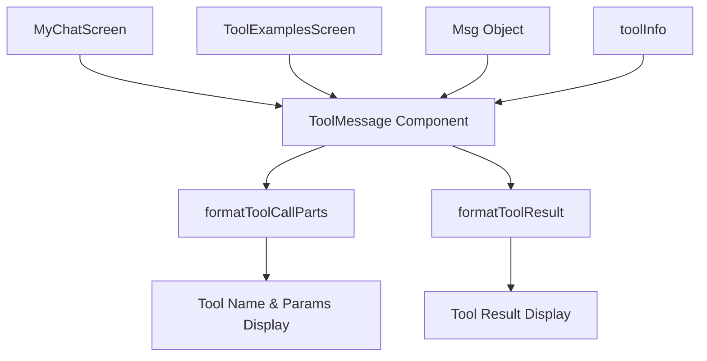

# Design Document

## Overview

This design document outlines the refactoring of tool UI components from MyChatScreen.tsx into reusable, well-tested components. The refactoring will extract tool rendering logic into a dedicated ToolMessage component, create utility functions for tool formatting, and build a ToolExamplesScreen for debugging purposes.

The design follows React best practices with pure components, proper TypeScript typing, and comprehensive testing. The extracted components will maintain the exact Claude Code visual styling while improving code maintainability and reusability.

## Architecture

### Component Hierarchy

```
src/
├── components/
│   └── tool/
│       ├── ToolMessage.tsx          # Main tool message component
│       └── ToolMessage.test.tsx     # Component tests
├── utils/
│   ├── toolFormatting.ts           # Formatting utilities
│   └── toolFormatting.test.ts      # Utility tests
├── screens/
│   ├── MyChatScreen.tsx            # Refactored chat screen
│   └── ToolExamplesScreen.tsx      # New examples screen
└── entrypoints/
    └── tool-examples.tsx           # Entry point for examples
```

### Data Flow



## Components and Interfaces

### ToolMessage Component

**Location:** `src/components/tool/ToolMessage.tsx`

**Purpose:** Renders a single tool execution message with Claude Code styling

**Props Interface:**
```typescript
interface ToolMessageProps {
  message: Msg
}

interface Msg {
  id: string
  role: 'user' | 'assistant' | 'tool'
  content: string
  rawContent?: any[]
  timestamp: Date
  isStreaming?: boolean
  toolInfo?: {
    name: string
    input: Record<string, any>
    status: 'running' | 'completed' | 'error'
    result?: string
    resultLines?: number
    expandInfo?: string
    middleLines?: string[]
  }
}
```

**Behavior:**
- Pure functional component (no state or side effects)
- Renders tool status with appropriate colored dots (gray/green/red)
- Handles multi-line output formatting for Bash tools
- Maintains exact Claude Code visual styling

### ToolExamplesScreen Component

**Location:** `src/screens/ToolExamplesScreen.tsx`

**Purpose:** Displays various tool UI states for debugging and development

**Features:**
- Scrollable list of tool examples
- Examples for all tool types (Read, Write, Edit, Bash, Glob, Grep, Search)
- Different states (running, completed, error)
- Edge cases (empty results, long output, special characters)
- Uses the same ToolMessage component as MyChatScreen

## Data Models

### Tool Formatting Utilities

**Location:** `src/utils/toolFormatting.ts`

**Functions:**

```typescript
/**
 * Formats tool call display parts (name and parameters)
 * @param name - Tool name (Read, Write, Bash, etc.)
 * @param input - Tool input parameters
 * @returns Formatted tool name and parameters string
 */
export function formatToolCallParts(
  name: string, 
  input: Record<string, any>
): { toolName: string; params: string }

/**
 * Formats tool execution results with proper line handling
 * @param name - Tool name
 * @param result - Raw tool execution result
 * @param isError - Whether the execution resulted in an error
 * @returns Formatted result with summary, middle lines, and expand info
 */
export function formatToolResult(
  name: string, 
  result: string, 
  isError: boolean
): {
  summary: string
  middleLines?: string[]
  expandInfo?: string
  lines?: number
}
```

### Example Data Structure

```typescript
// Example tool messages for ToolExamplesScreen
const exampleMessages: Msg[] = [
  {
    id: 'example-read-success',
    role: 'tool',
    content: 'Read 42 lines',
    timestamp: new Date(),
    toolInfo: {
      name: 'Read',
      input: { file_path: 'src/components/Button.tsx' },
      status: 'completed',
      result: 'file content...',
      resultLines: 42
    }
  },
  // ... more examples
]
```

## Error Handling

### Component Error Boundaries

- ToolMessage component handles missing toolInfo gracefully
- Fallback rendering for malformed tool data
- TypeScript strict mode prevents most runtime errors

### Utility Function Error Handling

- formatToolCallParts handles missing input fields
- formatToolResult handles empty or malformed results
- Graceful degradation for unknown tool types

## Testing Strategy

### Correctness Properties

*A property is a characteristic or behavior that should hold true across all valid executions of a system—essentially, a formal statement about what the system should do. Properties serve as the bridge between human-readable specifications and machine-verifiable correctness guarantees.*

#### Property 1: Visual Consistency Across All Tool States
*For any* tool message with valid toolInfo, the ToolMessage component should render with exact Claude Code styling including ⏺ symbol, proper spacing, appropriate dot colors (gray for running, green for completed, red for error), and ⎿ prefix for results
**Validates: Requirements 1.1, 1.2, 1.3, 1.4, 1.7, 2.3**

#### Property 2: Multi-line Output Formatting
*For any* tool result containing multiple lines (especially Bash output), the ToolMessage component should format the first line with ⎿ prefix, middle lines with 3-space indentation, and include expand info for results longer than 3 lines
**Validates: Requirements 1.5**

#### Property 3: Graceful Edge Case Handling
*For any* Msg object with missing or malformed toolInfo fields, the ToolMessage component should render without crashing and display fallback content appropriately
**Validates: Requirements 4.7**

#### Property 4: Chat Functionality Preservation
*For any* chat interaction sequence, the refactored MyChatScreen should behave identically to the original implementation in terms of message handling, streaming, and user interactions
**Validates: Requirements 2.2**

#### Property 5: Tool Formatting Utility Consistency
*For any* valid tool name and input parameters, the formatToolCallParts function should produce the same output as the original implementation in MyChatScreen
**Validates: Requirements 1.8, 1.9 (functional consistency)**

#### Property 6: Result Formatting Utility Consistency
*For any* tool execution result, the formatToolResult function should produce the same structured output (summary, middleLines, expandInfo) as the original implementation
**Validates: Requirements 1.8, 1.9 (functional consistency)**

### Unit Testing Approach

### Unit Testing Approach

**Dual Testing Strategy:**
- **Unit tests**: Verify specific examples, edge cases, and component integration
- **Property tests**: Verify universal properties across all inputs using property-based testing
- Both approaches are complementary and necessary for comprehensive coverage

**ToolMessage Component Tests:**
- Render tests for each tool status (running, completed, error)
- Visual regression tests to ensure Claude Code styling is maintained
- Props validation tests
- Edge case handling tests

**Utility Function Tests:**
- formatToolCallParts tests for all tool types
- formatToolResult tests for different result formats
- Edge case tests (empty input, special characters, very long output)

**ToolExamplesScreen Tests:**
- Basic rendering test
- Example data validation
- Component integration test

### Property-Based Testing Configuration

**Testing Framework:** Vitest with fast-check for property-based testing
**Test Iterations:** Minimum 100 iterations per property test
**Test Tagging:** Each property test must reference its design document property using the format:
`// Feature: tool-ui-refactor, Property N: [property description]`

**Property Test Implementation:**
- Property 1-3: Test ToolMessage component with generated tool messages
- Property 4: Integration test comparing old vs new MyChatScreen behavior  
- Property 5-6: Test utility functions with generated tool data

### Test Configuration

- Use Vitest for unit testing (existing project setup)
- Minimum 90% code coverage for new components
- Visual snapshot testing for UI components
- Property-based testing for utility functions

### Testing Files Structure

```
src/
├── components/tool/
│   ├── ToolMessage.tsx
│   └── ToolMessage.test.tsx
├── utils/
│   ├── toolFormatting.ts
│   └── toolFormatting.test.ts
└── screens/
    ├── ToolExamplesScreen.tsx
    └── ToolExamplesScreen.test.tsx
```