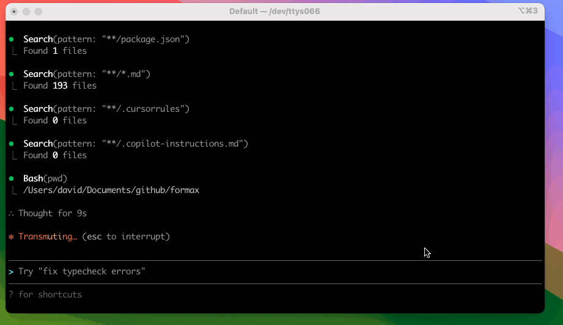

# Formax

Formax is a terminal-first AI assistant for software engineering tasks. It is inspired by (but not affiliated with) Claude Code v2.0.67, and some behaviors are implemented by observation (e.g. network traces) rather than upstream source code. Formax is experimental—review changes and commands before approving them; you are responsible for any modifications it makes to your files or system.

[](https://github.com/yusifeng/formax/actions/workflows/ci.yml)
[](https://codecov.io/gh/yusifeng/formax)
[](https://www.npmjs.com/package/@yusifeng/formax)
[](package.json)
[](LICENSE)

<p align="left">
  
</p>

## Quickstart

```bash
# Install (beta)
npm i -g @yusifeng/formax@beta

# In your project directory
cd /path/to/your/project

# Start the REPL
formax
```

## Web UI (for npm users)

If you want to use Formax in the browser after installing from npm:

```bash
formax web
```

By default:

- Web UI: `http://127.0.0.1:3781`
- Bridge (WebSocket): `ws://127.0.0.1:3777`

Optional flags:

```bash
formax web --host 127.0.0.1 --ui-port 3781 --bridge-port 3777
```

## App Server (GUI Integration)

Formax can run as a local subprocess JSON-RPC service (stdio JSONL transport) for IDE / GUI clients:

```bash
formax app-server
```

Handshake sequence:

1. Client sends `initialize`
2. Client sends `initialized` (notification)
3. Call `thread/*`, `turn/*`, `turn/input/submit`

Notes:

- Transport: **stdio + JSONL + JSON-RPC 2.0**
- Phase 1 focuses on thread/turn flows and the input lifecycle for approval and ask_user_question
- Full API reference: `plans/app-server/API-REFERENCE.md`

For source-level development, use the WebSocket dev bridge to debug GUI clients (non-production transport):

```bash
bun run app-server:bridge -- --host 127.0.0.1 --port 3777
```

Or start the web reference client (React + Vite + bridge, for development validation):

```bash
bun run app-server:web-reference -- --host 127.0.0.1 --bridge-port 3777 --ui-port 3781
```

Frontend code:

- `apps/web-reference-react/`

## Configuration

Formax will prompt you to configure missing credentials on first run.

Optional (writes to `~/.formax/` and runs connectivity checks):

```bash
formax setup
```

### Environment variables

```bash
export FORMAX_API_KEY="..."
export FORMAX_BASE_URL="https://api.anthropic.com"   # normalized to .../v1
export FORMAX_MODEL="..."                            # provider-specific model id

# optional
export FORMAX_TIMEOUT_MS="600000"
```

### Providers

Formax currently supports **Anthropic-compatible** APIs only. **OpenAI-compatible** and **Gemini** providers are not supported yet.

## REPL slash commands

Built-in commands (inside the REPL):

- `/agents` — create/manage sub-agents
- `/permissions` — manage tool permissions and workspace access
- `/hooks` — configure hooks
- `/todos` — list current todos
- `/clear` — clear the visible transcript
- `/compact [instructions]` — compact history into a summary in-context
- `/doctor` — run diagnostics from inside the REPL

## Customization (project-local)

Common `.formax/` folders:

- `.formax/commands/` — custom slash commands (`.md`)
- `.formax/agents/` — custom agents (`.md`)
- `.formax/hooks/` — hook scripts (e.g. `*.py`)
- `.formax/settings.local.json` — repo-local settings (permissions, hooks, etc.)

## Troubleshooting

Generate a redacted debug bundle:

```bash
formax doctor --bundle --bundle-tar
```


## License

MIT (see `LICENSE`).
