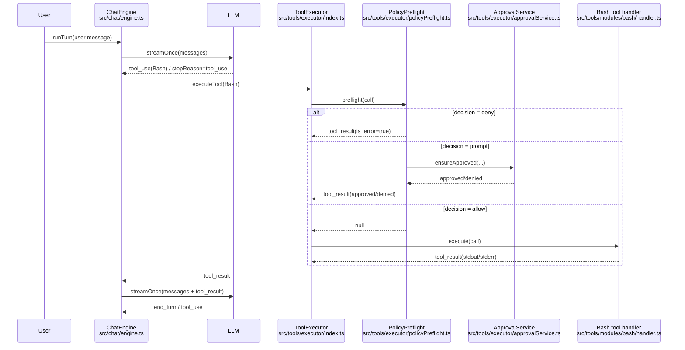
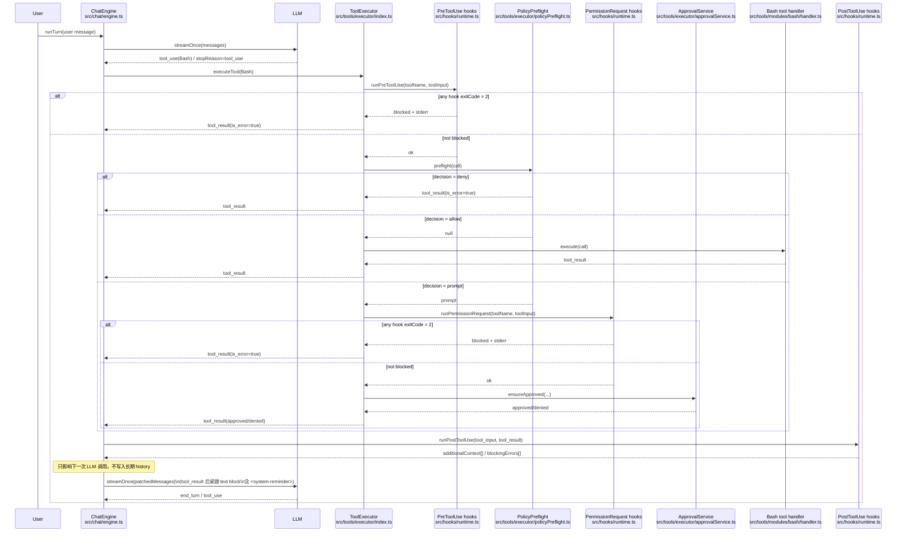

# Hooks Phase 1 — 时序图（Mermaid）

范围：仅 `PreToolUse` / `PermissionRequest` / `PostToolUse`（`type: command`）。

## 1) 无 hooks（传统流程）

以 `Bash(echo hi)` 为例：



对应代码位置：
- Chat loop：`src/chat/engine.ts`
- ToolExecutor：`src/tools/executor/index.ts`
- PolicyPreflight：`src/tools/executor/policyPreflight.ts`
- Approval UI：`src/tools/executor/approvalService.ts` + `src/tools/runtime/userInputManager.ts`
- Bash tool：`src/tools/modules/bash/handler.ts`

（文本版，便于复制/对照）

```text
User -> ChatEngine.runTurn
  ChatEngine -> LLM.streamOnce(messages)
    LLM -> ChatEngine: assistantBlocks=[tool_use(Bash)] stopReason=tool_use

  ChatEngine -> ToolExecutor(call=Bash)
    ToolExecutor -> PolicyPreflight(call=Bash)
      decision=allow | prompt | deny
      - allow: 返回 null
      - deny: 返回 tool_result(is_error=true)
      - prompt: ApprovalService.ensureApproved -> tool_result(通过/拒绝)

    ToolExecutor -> Bash.handler.execute -> tool_result(stdout/stderr)

  ChatEngine: 把 tool_result 作为 user message 追加到 loopMessages
  ChatEngine -> LLM.streamOnce(loopMessages+tool_result)
    LLM -> ChatEngine: end_turn 或继续 tool_use
```

关键点：下一轮 LLM 只看到 `tool_result`，没有额外注入。

## 2) 有 hooks（Phase 1 三件套）



对应代码位置：
- Chat loop + PostToolUse 注入：`src/chat/engine.ts`
- PreToolUse：`src/tools/executor/index.ts`
- PermissionRequest：`src/tools/executor/policyPreflight.ts`
- Hooks runtime：`src/hooks/runtime.ts`
- Hooks config merge：`src/hooks/store.ts`
- Hooks matcher：`src/hooks/matcher.ts`
- Hooks runner（command/并发/timeout/exit code/JSON parse）：`src/hooks/runner.ts`

（文本版，便于复制/对照）

```text
User -> ChatEngine.runTurn
  ChatEngine -> LLM.streamOnce(messages)
    LLM -> ChatEngine: assistantBlocks=[tool_use(Bash)] stopReason=tool_use

  ChatEngine -> ToolExecutor(call=Bash)
    ToolExecutor -> PreToolUse hooks
      - 任一 hook exitCode=2:
          ToolExecutor 直接返回 tool_result(is_error=true, "Tool blocked by PreToolUse hook")
          (preflight/handler 都不会执行)
      - 否则继续

    ToolExecutor -> PolicyPreflight(call=Bash)
      (policy/permissions/workspace/acceptEdits 等)
      decision=allow | prompt | deny

      - deny: 返回 tool_result(is_error=true)
      - allow: 返回 null -> 继续执行 handler
      - prompt:
          PolicyPreflight -> PermissionRequest hooks
            - 任一 hook exitCode=2:
                PolicyPreflight 直接返回 tool_result(is_error=true, "Permission denied <Tool>")
                (ApprovalService 不会弹 UI)
            - 否则继续 -> ApprovalService.ensureApproved -> tool_result

    ToolExecutor -> Bash.handler.execute -> tool_result

  ChatEngine: 把 tool_result 作为 user message 追加到 loopMessages

  ChatEngine -> PostToolUse hooks
    - exitCode=2: 产生 blockingErrors[]
    - stdout JSON: hookSpecificOutput.additionalContext -> additionalContext[]

  ChatEngine: 不把 additionalContext 写入 loopMessages（避免污染长期 history）
  ChatEngine: 只在“下一次 LLM 调用”前临时补丁 messages：
    user message: [... tool_result(t1), text("<system-reminder>...</system-reminder>")]

  ChatEngine -> LLM.streamOnce(patchedMessages)
    LLM 在下一轮能“看到” PostToolUse 注入的 system-reminder
```

关键差异：
- `PreToolUse`：在 preflight 前就能阻断工具
- `PermissionRequest`：在弹审批 UI 前能阻断（不弹 UI）
- `PostToolUse.additionalContext`：以 `tool_result` 后紧跟 `text` block 注入到下一轮请求，但不持久化进历史
