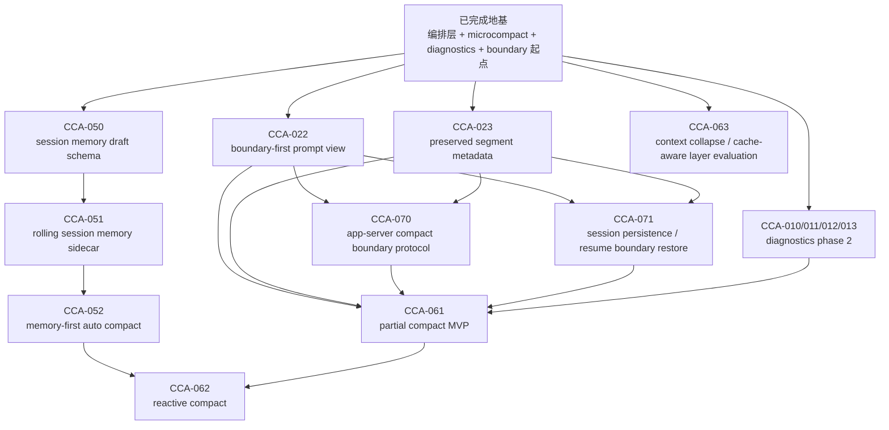

# CCA Dependency Map

更新时间：2026-05-11
状态：Active

## 这份图解决什么问题

`CCA-*` 编号是**能力切片编号**，不是严格的施工顺序。

也就是说：

- `CCA-010` 不一定比 `CCA-050` 更早做
- `CCA-060` 也不一定比 `CCA-022` 更晚做

真正决定执行顺序的，是：

1. 依赖关系
2. 返工风险
3. 当前收益
4. 哪些能力是在补“骨架”，哪些能力只是补“表现层”

所以这份图的作用是：

- 帮我们区分“任务编号”与“执行顺序”
- 明确哪些项是 blocker
- 明确当前主线应该怎么走

---

## 一句话规则

> `CCA` 编号用于定位任务；真正的执行顺序由依赖图决定。

---

## 依赖总图

---

## 分组理解

### 1. 地基组

这些项的作用是让整个上下文压缩系统“站起来”：

- 压缩编排层收敛
- `microcompact`
- `/context`
- compact boundary 起点
- rehydration 起点

它们已经基本完成。

如果没有这些地基，后面的：

- session memory
- partial compact
- reactive compact

都会很难做稳。

---

### 2. session memory 组

这组是我们最近已经完成的一条链：

1. `CCA-050`：session memory schema
2. `CCA-051`：rolling sidecar
3. `CCA-052`：memory-first auto compact

为什么这组可以先做？

因为它的依赖已经比较成熟：

- 已有 compact boundary
- 已有 rehydration
- 已有 diagnostics
- 已有统一压缩编排层

所以它虽然编号是 `05x`，但其实比 partial compact 更适合先做。

---

### 3. compact protocol 组

这组已经完成了最关键的前置主线：

1. `CCA-022`：boundary-first prompt view
2. `CCA-023`：preserved segment metadata

这两项是后续很多能力的 blocker。

尤其是：

- `CCA-061` partial compact
- `CCA-070` compact boundary app-server protocol
- `CCA-071` boundary-aware resume/restore

都依赖它们。

所以虽然编号是 `02x`，但在当前阶段它们比 `06x` 更应该先做。

---

### 4. higher-order compression 组

这组里最容易让人误会的是：

- `CCA-061` partial compact

它看起来像是“更高级的压缩策略”，
但本质上它其实是：

> compact 协议、history relink、resume restore、cross-surface parity 的综合题。

所以它不是一个能“先写个 MVP 看看”的小功能。

它的前置条件是：

1. `CCA-022`
2. `CCA-023`
3. `CCA-070`
4. `CCA-071`

这也是为什么 `CCA-060` 会先于 `CCA-061` 做。

`CCA-060` 本身不是 runtime 功能，而是：

> 明确 partial compact 现在是否能安全开工。

当前结论曾经是：`NO-GO`

参考：
- [CCA-060-partial-compact-go-no-go.md](./CCA-060-partial-compact-go-no-go.md)

---

## 当前主线顺序

当前推荐执行顺序不是按编号，而是按依赖：

1. `CCA-140` middle-layer strategy stack scaffolding
2. `CCA-141` tool-result budget replacement v1
3. `CCA-142` cache-aware microcompact v3
4. `CCA-143` snip layer v1（待前 3 项收口后再开）

对应含义：

1. `CCA-132` 已完成；post-132 重排已经完成
2. 当前最大结构性差距已经切换到“独立中间层策略栈”，而不是继续围绕 collapse surface 打补丁

## 新主线为什么这样排

### `CCA-140` 先于 `CCA-141`

`CCA-141` 的目标是引入第一条真正独立的新中间层策略：tool-result budget replacement。

如果没有 `CCA-140`，这条新策略很容易重新退化成：

1. 再往 `contextCompressionService.ts` 里塞一个特殊分支
2. 继续和 `microcompact` / `prune` 共享一堆隐含状态
3. diagnostics 再次事后推导，而不是复用 runtime facts

所以 `CCA-140` 的作用是先定义：

1. 统一的 strategy input
2. 统一的 strategy result
3. 统一的 execution order
4. runtime facts 与 diagnostics 的复用边界

只有这些有了承载，`CCA-141` 才不会变成又一段 ad hoc 逻辑。

### `CCA-141` 先于 `CCA-142`

`CCA-142` 的目标是把 `microcompact` 推进到 cache-aware / time-aware 路径。

如果没有先做 `CCA-141`，我们还是会把所有 query-time 压缩压力都堆给 `microcompact`，结果会是：

1. `microcompact` 继续承担 tool-result budget 管理
2. `microcompact` 继续承担部分 collapse 前的局部减压
3. 中间层的职责边界继续模糊

所以顺序上更合理的是：

1. 先让 tool-result budget 成为独立层
2. 再把 `microcompact` 推进到更成熟的 cached/time-aware 路径

当前状态：

- `CCA-140` 已完成
- `CCA-141` 已完成
- `CCA-142` 已完成
- 当前 backlog 入口是 `CCA-143`

### `CCA-143` 为什么放后

`snip` 是另一条很有价值的中间层，但它比 `CCA-141` 更容易和 `microcompact` / `collapse` 形成职责重叠。

所以更稳的顺序是：

1. 先把策略栈立起来
2. 先补 budget replacement
3. 先补 cache-aware microcompact
4. 再决定 `snip` 的第一版边界

---

## 为什么 `CCA-060` 能先于 `CCA-061`

这是一个典型例子：

- `CCA-060` 编号更小一些，但它不是“实现功能”
- 它是“判断 `CCA-061` 现在能不能安全做”

也就是说：

- `CCA-060` 是 `CCA-061` 的决策前置
- `CCA-061` 是真正的 runtime 能力

如果不先做 `CCA-060`，就容易出现这种问题：

1. partial compact 写了一半
2. 才发现 boundary-first view 还没有
3. resume 也不认 compact boundary
4. app-server / Web 也解释不了 compact 结构
5. 最后只能返工

所以这里“先做 `060`”不是跳号，
而是为了避免 `061` 的高返工风险。

---

## 哪些项是 blocker，哪些项是 supportive

### Blockers

这些不完成，就不建议继续做 `CCA-061`：

- `CCA-022`
- `CCA-023`
- `CCA-070`
- `CCA-071`

### Supportive

这些不是严格 blocker，但做了以后能明显降低后续不确定性：

- `CCA-010`
- `CCA-011`
- `CCA-012`
- `CCA-013`
- `CCA-052`

比如：

- `CCA-052` 让 compact 已经开始具备 memory-first 结构
- diagnostics Phase 2 会让 partial compact 的验证更容易

但它们不能替代 blocker 本身。

---

## 当前结论

如果后面再看到“为什么不是按编号顺序做”，统一按这条规则理解：

1. `CCA` 是能力编号，不是施工顺序
2. 当前主线按依赖图推进，不按数字大小推进
3. 当前最该做的不是 `CCA-061`
4. 当前最该做的是：
   - `CCA-022`
   - `CCA-023`
   - 然后 `CCA-070`
   - `CCA-071`

只有这些条件成熟以后，partial compact 才值得真正开工
