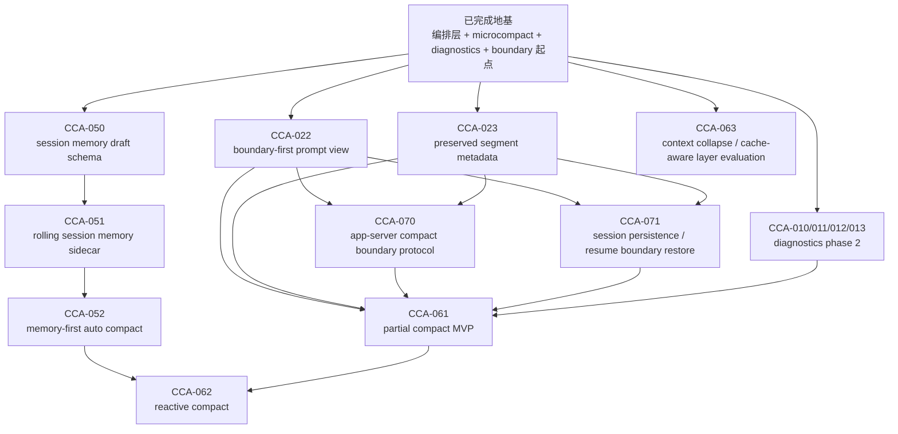

# CCA Dependency Map

更新时间：2026-05-12
状态：Active

## 这份图解决什么问题

`CCA-*` 编号是**能力切片编号**，不是严格的施工顺序。

也就是说：

- `CCA-010` 不一定比 `CCA-050` 更早做
- `CCA-060` 也不一定比 `CCA-022` 更晚做

真正决定执行顺序的，是：

1. 依赖关系
2. 返工风险
3. 当前收益
4. 哪些能力是在补“骨架”，哪些能力只是补“表现层”

所以这份图的作用是：

- 帮我们区分“任务编号”与“执行顺序”
- 明确哪些项是 blocker
- 明确当前主线应该怎么走

---

## 一句话规则

> `CCA` 编号用于定位任务；真正的执行顺序由依赖图决定。

---

## 依赖总图

---

## 分组理解

### 1. 地基组

这些项的作用是让整个上下文压缩系统“站起来”：

- 压缩编排层收敛
- `microcompact`
- `/context`
- compact boundary 起点
- rehydration 起点

它们已经基本完成。

如果没有这些地基，后面的：

- session memory
- partial compact
- reactive compact

都会很难做稳。

---

### 2. session memory 组

这组是我们最近已经完成的一条链：

1. `CCA-050`：session memory schema
2. `CCA-051`：rolling sidecar
3. `CCA-052`：memory-first auto compact

为什么这组可以先做？

因为它的依赖已经比较成熟：

- 已有 compact boundary
- 已有 rehydration
- 已有 diagnostics
- 已有统一压缩编排层

所以它虽然编号是 `05x`，但其实比 partial compact 更适合先做。

---

### 3. compact protocol 组

这组已经完成了最关键的前置主线：

1. `CCA-022`：boundary-first prompt view
2. `CCA-023`：preserved segment metadata

这两项是后续很多能力的 blocker。

尤其是：

- `CCA-061` partial compact
- `CCA-070` compact boundary app-server protocol
- `CCA-071` boundary-aware resume/restore

都依赖它们。

所以虽然编号是 `02x`，但在当前阶段它们比 `06x` 更应该先做。

---

### 4. higher-order compression 组

这组里最容易让人误会的是：

- `CCA-061` partial compact

它看起来像是“更高级的压缩策略”，
但本质上它其实是：

> compact 协议、history relink、resume restore、cross-surface parity 的综合题。

所以它不是一个能“先写个 MVP 看看”的小功能。

它的前置条件是：

1. `CCA-022`
2. `CCA-023`
3. `CCA-070`
4. `CCA-071`

这也是为什么 `CCA-060` 会先于 `CCA-061` 做。

`CCA-060` 本身不是 runtime 功能，而是：

> 明确 partial compact 现在是否能安全开工。

当前结论曾经是：`NO-GO`

参考：
- [CCA-060-partial-compact-go-no-go.md](./CCA-060-partial-compact-go-no-go.md)

---

## 当前主线顺序

当前推荐执行顺序不是按编号，而是按依赖：

1. `CCA-170` manual compact task-minimal parity
2. `CCA-171` higher-order restore utility v6
3. `CCA-172` compact protocol deeper inspection parity

对应含义：

1. `CCA-140 ~ 146` 已完成，middle-layer stack 的第一阶段已经成型
2. `CCA-150` 与 `CCA-160` 已完成，working-set selector 已从 anchor-kind-aware window 推进到 task-minimal v5
3. `CCA-151` 与 `CCA-161` 已完成，session-memory restore 已从 one-turn reminder 扩到结构化 utility surface
4. 当前这条 compact protocol 的 remote / restore ecosystem 对齐主线已完成
5. post-`CCA-153` mainline re-rank 已完成，`CCA-162` 与 `CCA-163` 也已收口，post-`CCA-163` mainline re-rank 也已完成，当前新的动作应先切到 `CCA-170`

## 新主线为什么这样排

### `CCA-160` 为什么先做

`CCA-150` 已经解决了“filesystem exploration 不该被过早丢掉”，但还没有真正解决：

1. 当前任务最小工作集到底应该怎么选
2. recent planning / todo / execution state 该如何和 filesystem cluster 一起参与 keep strategy
3. 为什么这段保留、那段放弃，如何被 diagnostics 清楚解释

如果不先做 `CCA-160`，后面的 session-memory utility 与 replay parity 都会继续建立在“working-set 还不够 task-minimal”的基础上，边际收益会被压低。

### `CCA-161` 为什么先于 replay parity 做

`CCA-160` 已完成后，当前剩余差距已经从“working-set 还不够 task-minimal”收敛成：

1. restore 后的 session-memory 还不够实用
2. compact protocol 在 replay / inspection 面还不够深
3. time-aware microcompact 当时仍然是后置增强项

`CCA-151` 已经把 restore reminder 注入做到了 app-server surface。  
但 session-memory 目前还更像：

1. sidecar 会刷新
2. restore 时会给一条 next-turn-only reminder
3. diagnostics 能解释这条 reminder

离“更稳定地帮助恢复当前任务语义”还差一层 utility。  
所以它应该排在 working-set 之后，而不是之前。

### `CCA-162` 为什么排第三

`CCA-153` 已经补上了 restore surface 对 compact boundary 的最小消费。  
下一层更自然的不是再扩更多 transport surface，而是：

1. replay / inspection 能否直接读到 compact protocol facts
2. preserved segment / boundary 的更完整消费是否能在 inspection 面收口

这条线有价值，但它建立在 160/161 更稳定之后收益更高，所以放第三。

### `CCA-163` 为什么当时只放第四

time-aware / stale-aware `microcompact` 仍然值得做，但现在它已经不是最大阻塞：

1. middle-layer stack 已经成型
2. restore / remote compact protocol 也已有最小闭环
3. 当前最明显的剩余 gap 更偏“工作集质量”和“restore 实用性”

所以 `CCA-163` 当时应视为策略深度增强项，而不是新的 P0 主线。

## post-`CCA-163` mainline re-rank

16x 波段收口后，最值得继续补的已经不再是 reducer 深度，而是：

1. manual `/compact` 与 task-minimal keep strategy 之间的语义落差
2. restore utility 对更高阶任务状态的缺口
3. compact protocol 在 inspection 面的更深消费

因此新的 17x 主线应当切成：

1. `CCA-170` manual compact task-minimal parity
2. `CCA-171` higher-order restore utility v6
3. `CCA-172` compact protocol deeper inspection parity

## 已完成波段为什么可以收口

当前状态：

- `CCA-140` 已完成
- `CCA-141` 已完成
- `CCA-142` 已完成
- `CCA-143` 已完成
- `CCA-144` 已完成
- `CCA-145` 已完成
- `CCA-146` 已完成
- `CCA-150` 已完成
- `CCA-151` 已完成
- `CCA-152` 已完成
- `CCA-153` 已完成

这意味着：

1. middle-layer stack 的 contract / coordination / control-plane / snip 已成型
2. working-set selector 已从固定 1-turn rewind 推进到 anchor-kind-aware window
3. restore surface 现在也已经能直接读到最近 compact boundary 的 canonical protocol facts
4. 当前已经没有必要继续围绕这条 compact protocol 主线做默认扩张；更合理的是切到新的 16x 主线

---

## 为什么 `CCA-060` 能先于 `CCA-061`

这是一个典型例子：

- `CCA-060` 编号更小一些，但它不是“实现功能”
- 它是“判断 `CCA-061` 现在能不能安全做”

也就是说：

- `CCA-060` 是 `CCA-061` 的决策前置
- `CCA-061` 是真正的 runtime 能力

如果不先做 `CCA-060`，就容易出现这种问题：

1. partial compact 写了一半
2. 才发现 boundary-first view 还没有
3. resume 也不认 compact boundary
4. app-server / Web 也解释不了 compact 结构
5. 最后只能返工

所以这里“先做 `060`”不是跳号，
而是为了避免 `061` 的高返工风险。

---

## 哪些项是 blocker，哪些项是 supportive

### Blockers

这些不完成，就不建议继续做 `CCA-061`：

- `CCA-022`
- `CCA-023`
- `CCA-070`
- `CCA-071`

### Supportive

这些不是严格 blocker，但做了以后能明显降低后续不确定性：

- `CCA-010`
- `CCA-011`
- `CCA-012`
- `CCA-013`
- `CCA-052`

比如：

- `CCA-052` 让 compact 已经开始具备 memory-first 结构
- diagnostics Phase 2 会让 partial compact 的验证更容易

但它们不能替代 blocker 本身。

---

## 当前结论

如果后面再看到“为什么不是按编号顺序做”，统一按这条规则理解：

1. `CCA` 是能力编号，不是施工顺序
2. 当前主线按依赖图推进，不按数字大小推进
3. 当前最该做的不是 `CCA-061`
4. 当前最该做的是：
   - `CCA-022`
   - `CCA-023`
   - 然后 `CCA-070`
   - `CCA-071`

只有这些条件成熟以后，partial compact 才值得真正开工
