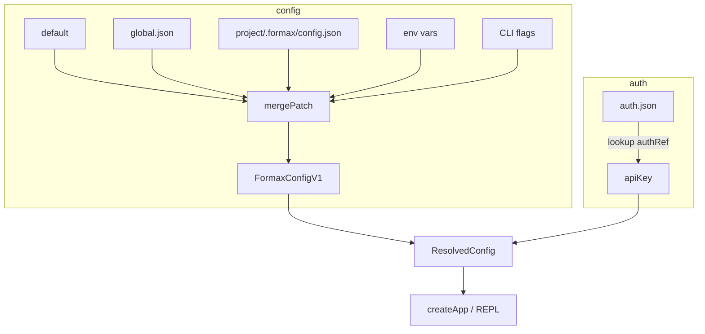

# src/core

Status: Informative deep dive.

Canonical docs:
- [docs/contracts/config-settings-contract.md](../../docs/contracts/config-settings-contract.md)
- [docs/contracts/layer-contract.md](../../docs/contracts/layer-contract.md)
- [docs/contracts/invariants.md](../../docs/contracts/invariants.md)
- [docs/contracts/permissions-policy-contract.md](../../docs/contracts/permissions-policy-contract.md)
- [docs/environment-variables.md](../../docs/environment-variables.md)

本文件用于代码近侧说明、边界总览和扩展/排障提示；涉及长期规则、权限语义和运行时配置时，先更新上面的 canonical docs。

Last verified: 2026-01-13

## 1) 作用（What）

产品化核心层：提供配置解析、认证管理、首次设置向导、诊断检查与策略引擎。

- **做什么**：
  - Config（配置）：多源配置合并（default → global → project → env → flags）
  - Auth（认证）：管理 API key 存储（auth.json）
  - Setup（设置）：首次运行向导 session 状态机
  - Diagnostics（诊断）：`formax doctor` 健康检查
  - Policy（策略）：权限规则匹配引擎（fs.read/write/bash.exec/net.fetch）
  - App：应用级工厂 (`createApp`) 和事件总线
- **不做什么**：
  - 不处理 UI 渲染（由 `ui/` 负责）
  - 不执行工具（由 `tools/` 负责）
  - 不做 LLM 通信（由 `streaming/` 负责）

## 2) 入口（Entry points）

| 入口                | 说明                                 |
| ------------------- | ------------------------------------ |
| `config/resolve.ts` | resolveRuntimeConfig 合并各层配置    |
| `auth/index.ts`     | authList/authSet/authDelete 管理凭证 |
| `setup/session.ts`  | createSetupSession 首次向导状态机    |

上层 `src/runtime/bootstrap/` 和 CLI entrypoint 调用这些函数完成启动前准备。

## 3) 流程（Flow）

1. `resolveRuntimeConfig` 按 SOURCE_ORDER 合并配置
2. 若 `llm.authRef` 存在，从 auth store 查找 apiKey
3. 最终返回 `ResolvedConfig { config, auth, sources, warnings }`
4. CLI 用此配置初始化 StreamClient 和工具上下文

## 4) 边界与约束（Boundaries / Invariants）

### ✅ 允许

- 任何模块可读取 core 导出的纯函数/类型
- `adapters/fs/` 负责文件读写，core 只做逻辑
- `ui/` 可使用 setup/session 渲染向导
- `cli/` 可使用 diagnostics/doctor 执行健康检查

### ❌ 禁止

- core 不得 import `adapters/`（由 adapters 实现 core 接口）
- core 不得 import `ui/`、`cli/`、`screens/`（禁止反向依赖）
- core 不得 import `tools/`、`streaming/`
- Policy engine 不做实际文件操作（只返回 decision）
- Auth store 不得存储明文密码以外的敏感信息（TODO(verify) 如 OAuth token）

### 关键不变量

1. **配置来源溯源**：`sources` 记录每个配置项最终来自哪层
2. **auth.json mode 0o600**：写入时必须限制权限
3. **Policy 优先级**：deny > prompt > allow；session > project > global

## 5) 如何扩展（How to extend）

### 添加新配置项

1. 在 `config/schema.ts` 更新 `FormaxConfigV1Schema`（zod 校验）
2. 在 `config/resolve.ts` 的 `envToPatch` 添加环境变量映射
3. 在 `KNOWN_SOURCE_KEYS` 添加新 key 以便追踪来源
4. 运行 `bun run test -- src/core/config`

### 添加新 provider

1. 在 `config/schema.ts` ProviderId 添加新值
2. 在 `setup/session.ts` DEFAULT_BASE_URL 添加默认 URL
3. 在 `diagnostics/doctor.ts` 添加连接测试逻辑
4. 运行 `bun run test -- src/core`

### 添加 policy action 类型

1. 在 `policy/schema.ts` 添加新 match kind（如 `mcp.call`）
2. 在 `policy/engine.ts` DEFAULT_DECISIONS 添加默认决策
3. 在 `matchSpecificity` 添加匹配逻辑
4. 运行 `bun run test -- src/core/policy`

## 6) 常见坑 & 排查（Pitfalls / Debug）

| 现象                   | 优先检查                                                         | 命令                                             |
| ---------------------- | ---------------------------------------------------------------- | ------------------------------------------------ |
| 配置加载后 apiKey 为空 | `auth.json` 是否存在 + authRef 拼写                              | `bun run dev -- doctor`                          |
| env 变量不生效         | `resolve.ts` envToPatch 映射 + 变量名（如 `FORMAX_API_KEY`）      | `bun run type-check`                             |
| policy 规则匹配失败    | `engine.ts` matchPathPrefix/matchWordPrefix 逻辑                 | `bun run test -- src/core/policy/engine.test.ts` |
| setup 向导跳步骤       | `session.ts` step 状态机 back/next                               | `bun run test -- src/core/setup/session.test.ts` |
| doctor 报连接失败      | `diagnostics/doctor.ts` testConnection 参数                      | `bun run dev -- doctor`                          |

## 7) 相关链接（Repo links）

- [CODEMAP.md#config--auth--paths](../../CODEMAP.md#config--auth--paths)
- [AGENTS.md#configuration--runtime-notes](../../AGENTS.md#configuration--runtime-notes)
