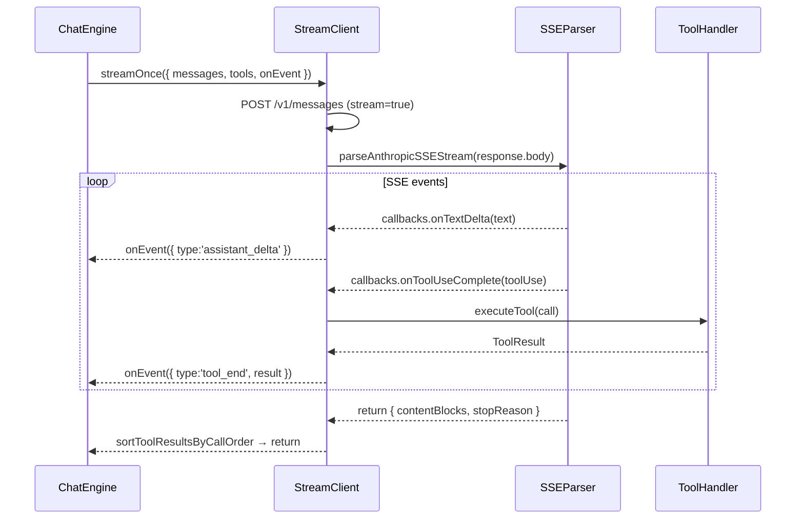

# src/streaming

Last verified: 2026-01-13

## 1) 作用（What）

Anthropic API 流式通信层：处理 SSE 解析、tool 并行执行与事件广播。

- **做什么**：
  - StreamClient：发起 HTTP 请求、管理 timeout、执行 tool 并收集结果
  - SSE Parser：解析 Anthropic 的 Server-Sent Events（text_delta / tool_use_start / content_block_stop 等）
  - StreamEvent：统一的事件类型（assistant_delta / tool_start / tool_end / error / complete）
- **不做什么**：
  - 不定义 tool 行为（由 `tools/` 负责）
  - 不持久化对话（由上层 chat engine 管理 history）
  - 不渲染 UI（由 `components/` 负责）

## 2) 入口（Entry points）

| 入口                        | 说明                                   |
| --------------------------- | -------------------------------------- |
| `anthropic/StreamClient.ts` | AnthropicStreamClient 类，发起流式请求 |
| `anthropic/sseParser.ts`    | parseAnthropicSSEStream 解析 SSE 流    |
| `types.ts`                  | StreamEvent / StreamSink / TokenUsage / LlmStreamClient |

上层 chat engine (`src/chat/engine.ts`) 依赖 `LlmStreamClient` 接口；legacy wiring 目前注入的是 `AnthropicStreamClient`（实现 `LlmStreamClient`）。

## 3) 流程（Flow）

1. `streamOnce` 构造 payload 并发起 fetch（带 timeout + AbortSignal）
2. `parseAnthropicSSEStream` 逐行解析 SSE，通过 callbacks 回调
3. `onToolUseComplete` 异步调用 `executeTool`，结果存入 toolResults
4. 解析完成后等待所有 pending tool execution
5. 按 API 返回的 tool_use 顺序排序结果（sortToolResultsByCallOrder）

## 4) 边界与约束（Boundaries / Invariants）

### ✅ 允许

- 上层传入自定义 `onEvent` sink 做额外日志/统计
- 可传入 `signal` 中断请求
- Parser callbacks 可并行触发 tool 执行

### ❌ 禁止

- StreamClient 不得访问文件系统（工具执行由传入的 executor 负责）
- SSE Parser 不得知道具体 tool 语义
- 不得在 streaming 层缓存历史消息（由 chat engine 负责）
- 不得假设 tool_use 事件顺序（需用 sortToolResultsByCallOrder 对齐）

### 关键不变量

1. **Tool 结果顺序**：必须与 API block 顺序一致，否则后续 messages 校验会失败
2. **Timeout 默认 10 分钟**（600000ms），可通过 config 配置
3. **AbortSignal**：用户取消 / timeout 都会触发 abort，handler 需检查 `signal.aborted`

## 5) 如何扩展（How to extend）

### 添加新 SSE 事件类型

1. 在 `sseParser.ts` 的 `handleSSEEvent` 添加 case
2. 在 `types.ts` 的 `StreamEvent` union 添加新变体
3. 在 `StreamClient.ts` 的 sseCallbacks 添加对应回调
4. 运行 `bun run test -- src/streaming/anthropic/sseParser.test.ts`

### 支持新 API provider

1. 创建 `<provider>/StreamClient.ts` 和 `<provider>/sseParser.ts`
2. 实现 `LlmStreamClient.streamOnce` 接口，返回 `{ assistantBlocks, stopReason, toolResults }`
3. 上层 engine 根据 config 选择 client

### 添加 token 使用统计

- StreamClient 在 `result.usage` 存在时发送 `{ type:'usage', usage, model }`
- 上层 UI 监听此事件并累加显示

## 6) 常见坑 & 排查（Pitfalls / Debug）

| 现象                            | 优先检查                                        | 命令                                                                           |
| ------------------------------- | ----------------------------------------------- | ------------------------------------------------------------------------------ |
| 流卡住无响应                    | `StreamClient.ts` timeout 设置 + fetch 是否抛错 | 检查 `.env` 中 `FORMAX_TIMEOUT_MS`                                            |
| 丢事件（tool_end 未触发）       | `sseParser.ts` handleSSEEvent case 匹配         | `bun run test -- src/streaming/anthropic/sseParser.test.ts`                    |
| Tool 结果顺序错乱               | `sortToolResultsByCallOrder` 逻辑               | `bun run test -- src/streaming/anthropic/StreamClient.sortToolResults.test.ts` |
| JSON 解析失败（thinking block） | `sseParser.ts` inputJSONBuffers 拼接逻辑        | 添加 console.log 在 `content_block_stop` 分支                                  |
| AbortError 频繁出现             | 检查 signal 来源 + 是否 timeout                 | -                                                                              |

## 7) 相关链接（Repo links）

- [CODEMAP.md#chat-loop--streaming](../../CODEMAP.md#chat-loop--streaming)
- [types.ts](./types.ts)
