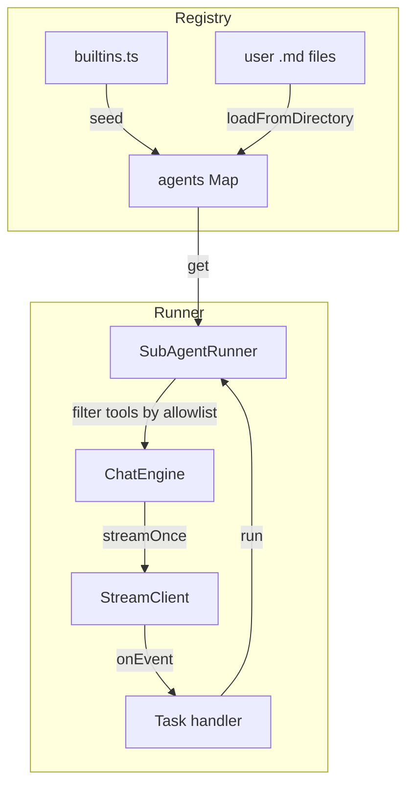

# src/subagents

Last verified: 2026-01-13

## 1) 作用（What）

Sub-agent 系统：提供命名 agent 的注册、工具白名单隔离与独立执行上下文。

- **做什么**：
  - Registry（注册表）：加载内置 agent + 从目录加载用户自定义 agent（.md frontmatter 格式）
  - Runner（执行器）：创建隔离的 ChatEngine，按 agent 定义的 tools 白名单执行
  - Builtins（内置 agents）：general-purpose / Explore / Plan / claude-code-guide / statusline-setup
  - Prompts：各 agent 的 system prompt 模板（支持变量插值）
- **不做什么**：
  - 不定义工具行为（由 `tools/` 负责）
  - 不直接渲染 UI（通过 StreamEvent 上报，由上层渲染）
  - 不管理 token 限制（由 StreamClient 负责）

## 2) 入口（Entry points）

| 入口          | 说明                                         |
| ------------- | -------------------------------------------- |
| `registry.ts` | createSubAgentRegistry 工厂，管理 agent 配置 |
| `runner.ts`   | createSubAgentRunner 执行 agent 任务         |
| `builtins.ts` | getBuiltinSubagents 返回内置 agent 列表      |

上层 Task 工具 handler（`tools/modules/task/handler.ts`）调用 runner.run 启动 sub-agent。

## 3) 流程（Flow）



1. CLI 启动时调用 `registry.loadFromDirectories(...)`
   - 当前实现会同时加载 user-level（`~/.formax/agents/`）与 project-level（`.formax/agents/`），并以 project 覆盖 user（也兼容 `.claude/agents/`）
2. Task 工具 handler 调用 `registry.get(agentName)` 获取配置
3. Runner 根据 `agent.tools` 过滤全量工具列表
4. Runner 创建隔离 ChatEngine 并执行（agentDepth=1）
5. 执行完成返回 `{ agentId, summary, success }`

## 4) 边界与约束（Boundaries / Invariants）

### ✅ 允许

- Agent 可指定 `tools: ['*']` 使用所有工具
- Agent 可指定具体工具列表做白名单隔离
- Runner 支持 resume（用 agentId 继续上次对话）
- 用户可在 `~/.formax/agents/` 添加 user-level agent，也可在项目的 `.formax/agents/` 添加 project-level agent（优先级更高）

### ❌ 禁止

- Sub-agent 硬拒绝会话/交互型工具：`Task` / `TaskOutput` / `AskUserQuestion` / `EnterPlanMode` / `ExitPlanMode` / `KillShell`（见 `src/tools/executor/subagentDenyTools.ts`）
- Explore/Plan 额外硬拒绝写工具：`Edit` / `Write` / `NotebookEdit`（见 `src/subagents/runner.ts`）
- Agent system prompt 不得包含敏感信息（会传给 LLM）
- Registry 不做工具校验（只存名称列表）
- Runner 不管理持久化 session（内存 Map，进程退出即失效）

### 关键不变量

1. **SUBAGENT_DENY_TOOLS**：防止无限递归调用 sub-agent
2. **agentDepth > 0**：Executor 自动拒绝 `SUBAGENT_DENY_TOOLS`
3. **summary 截断**：默认 500 字符 + `…`

## 5) 如何扩展（How to extend）

### 添加内置 sub-agent

1. 在 `prompts/` 创建 `agent-prompt-<name>.md`（system prompt）
2. 在 `builtins.ts` 的 `getBuiltinSubagents()` 添加配置：
   ```ts
   {
     name: '<name>',
     description: '...',
     tools: ['Read', 'Glob'],  // 或 ['*']
     systemPrompt: loadPrompt('agent-prompt-<name>.md', vars, fallback),
   }
   ```
3. 运行 `bun run test -- src/subagents`

### 用户自定义 sub-agent

1. 在 `~/.formax/agents/` 创建 `my-agent.md`（或在项目 `.formax/agents/`）：
   ```yaml
   ---
   name: my-agent
   description: My custom agent
   tools: Read, Grep
   model: sonnet
   color: blue
   ---
   You are my custom agent...
   ```
2. CLI 启动时自动加载

### 给 agent 添加工具权限

- 修改 `agent.tools` 数组
- `['*']` 表示全部（仍受 NESTED_DENY_TOOLS 限制）
- 未列出的工具会返回 "not in allow-list" 错误

## 6) 常见坑 & 排查（Pitfalls / Debug）

| 现象                            | 优先检查                                                           | 命令                                             |
| ------------------------------- | ------------------------------------------------------------------ | ------------------------------------------------ |
| Agent 找不到（Unknown agent）   | `registry.get()` 返回 undefined + 检查名称拼写                     | 添加 `console.log(registry.list())`              |
| 工具被拒绝（not in allow-list） | 检查 agent.tools 配置 + NESTED_DENY_TOOLS                          | `bun run test -- src/subagents/runner.test.ts`   |
| Frontmatter 解析失败            | `registry.ts` parseFrontmatter 逻辑 + 检查 `---` 格式              | `bun run test -- src/subagents/registry.test.ts` |
| resume 失败                     | 检查 agentId 是否匹配 + agent name 是否一致                        | -                                                |
| Prompt 变量未替换               | `builtins.ts` interpolatePrompt + 变量名（如 `${GLOB_TOOL_NAME}`） | -                                                |

## 7) 相关链接（Repo links）

- [CODEMAP.md#sub-agents-task-tool](../../CODEMAP.md#sub-agents-task-tool)
- [builtins.ts](./builtins.ts)
- [prompts/](./prompts/)
