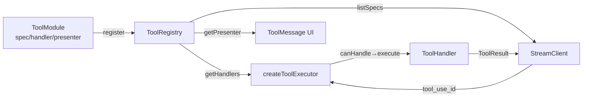

# src/tools

Last verified: 2026-01-13

## 1) 作用（What）

工具系统核心：提供 tool 注册、加载、执行与渲染的完整管道。

- **做什么**：
  - Registry（注册表）：集中管理 tool 的 handler、presenter、spec 和元数据
  - Loader（加载器）：从 JSON 文件加载工具定义（外部工具）
  - Executor（执行器）：路由工具调用、校验 allow/deny list、分发给 handler 执行
  - Runtime（运行时）：管理后台任务（TaskManager）和用户输入请求（UserInputManager）
  - Presenter（呈现器）：为每个工具提供 Ink UI 渲染组件
- **不做什么**：
  - 不处理 streaming 解析（由 `streaming/` 负责）
  - 不持久化工具状态（执行完即结束，状态由上层 chat loop 管理）
  - 不定义 subagent 运行逻辑（由 `subagents/` 负责）

## 2) 入口（Entry points）

| 入口                | 说明                                  |
| ------------------- | ------------------------------------- |
| `registry.ts`       | ToolRegistry 类，注册并查询工具       |
| `executor/index.ts` | createToolExecutor 工厂，返回执行函数 |
| `loader.ts`         | loadToolDefinitions 加载外部 JSON     |

上层 chat engine (`src/chat/engine.ts`) 在初始化时：

1. 从 registry 获取 handlers → 传给 executor
2. 从 registry 获取 specs → 传给 streaming client

## 3) 流程（Flow）

1. 启动时 `modules/*/index.ts` 调用 `registry.register(module)`
2. Chat engine 用 `registry.listSpecs()` 把工具定义发给 LLM
3. LLM 返回 tool_use 时 StreamClient 调用 executor
4. Executor 检查 allow/deny list → 找 handler → 执行
5. 结果通过 `onEvent({ type:'tool_end', result })` 上报 UI
6. Presenter 渲染该工具的执行状态

## 4) 边界与约束（Boundaries / Invariants）

### ✅ 允许

- 新增 tool module 到 `modules/` 并在 registry 注册
- Handler 可异步、可请求用户输入（通过 UserInputManager）
- Handler 可创建后台任务（通过 TaskManager）
- Presenter 可访问 tool call 的 input/result
- Executor 可在 sub-agent context 中限制工具（agentDepth > 0 自动禁用 Task/Agent/Dispatch）

### ❌ 禁止

- Handler 不得直接操作 UI（只能返回 ToolResult 或发送 StreamEvent）
- Handler 不得修改 registry 状态
- Presenter 不得执行副作用（只负责渲染）
- 禁止在 handler 中 import streaming 模块（依赖方向应为 streaming → tools）
- Sub-agent 禁用 Task/Agent/Dispatch/SlashCommand 工具（由 NESTED_DENY_TOOLS 硬编码）

### 关键不变量

1. **Spec-Handler 一一对应**：每个 spec.name 应有且仅有一个 handler 能 canHandle
2. **执行顺序**：allow/deny 校验 → agentDepth 校验 → handler 路由 → 执行
3. **状态归属**：TaskManager 管后台任务生命周期；UserInputManager 管用户输入 promise

## 5) 如何扩展（How to extend）

### 新增一个 tool

1. 创建 `modules/<name>/spec.ts`（工具定义）、`handler.ts`（执行逻辑）、`presenter.tsx`（UI）、`index.ts`（导出 ToolModule）
2. 在 `index.ts` 中 export `createXToolModule()` 工厂
3. 在 `registry.ts` 文件底部调用 `registry.register(createXToolModule())`
4. 验证：`bun run tools:coverage` 检查覆盖率

### 给工具添加审批流程

1. Handler 调用 `userInputManager.requestAnswers(...)` 返回 Promise
2. UI 层（如 `editApprovalPrompt.tsx`）监听 pending 状态并渲染选项
3. 用户选择后调用 `userInputManager.submitAnswers(...)`

### 添加后台长任务

1. Handler 调用 `taskManager.create({ run: ... })` 返回 taskId
2. 立即返回 `ToolResult`，告知 LLM taskId
3. 后续用 TaskOutput 工具查询/取消该任务

## 6) 常见坑 & 排查（Pitfalls / Debug）

| 现象                                        | 优先检查                                                   | 命令                                                    |
| ------------------------------------------- | ---------------------------------------------------------- | ------------------------------------------------------- |
| LLM 调用工具但返回 "Tool X not implemented" | `executor/index.ts` NESTED_DENY_TOOLS + handler canHandle  | `bun run type-check`                                    |
| Spec/Handler 名称不一致导致漏执行           | `SPEC_HANDLER_MISMATCHES.md` 文档 + `bun run tools:parity` | `bun run tools:parity`                                  |
| 用户输入卡住（Promise 未 resolve）          | `runtime/userInputManager.ts` pending map                  | -                                                       |
| 后台任务执行后结果丢失                      | `runtime/taskManager.ts` 任务是否 resolveDone              | `bun run test -- src/tools/runtime/taskManager.test.ts` |
| Presenter 报错导致 UI 崩溃                  | `presenters/fallback.tsx` 兜底渲染                         | -                                                       |
| allow/deny list 不生效                      | `executor/index.ts` normalizeCtx 检查                      | `bun run test -- src/tools/executor`                    |

## 7) 相关链接（Repo links）

- [CODEMAP.md#tools-registry--loader](../../CODEMAP.md#tool-registry--loader)
- [CODEMAP.md#tool-execution-pipeline](../../CODEMAP.md#tool-execution-pipeline)
- [CODEMAP.md#tool-ui--presenters](../../CODEMAP.md#tool-ui--presenters)
- [SPEC_HANDLER_MISMATCHES.md](./SPEC_HANDLER_MISMATCHES.md)
- [STATUS.md](./STATUS.md)
